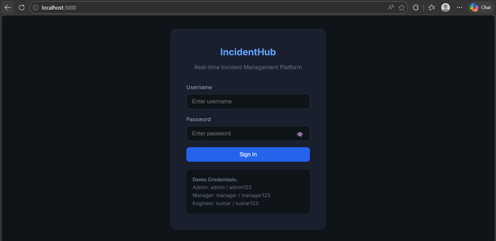
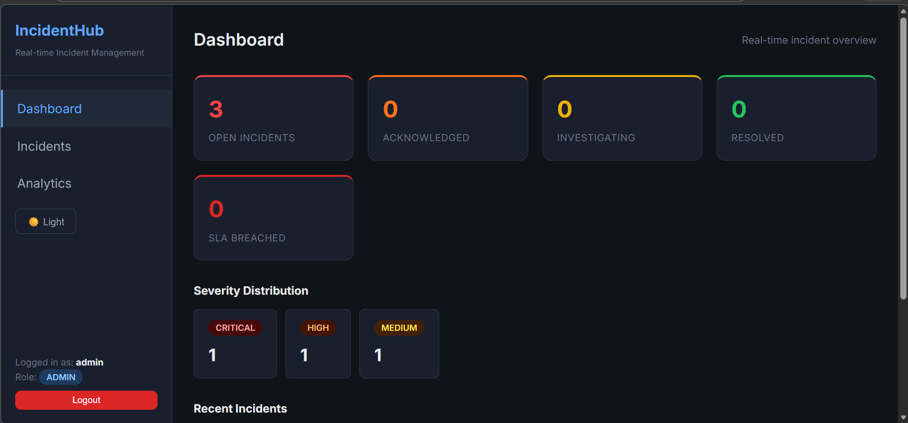
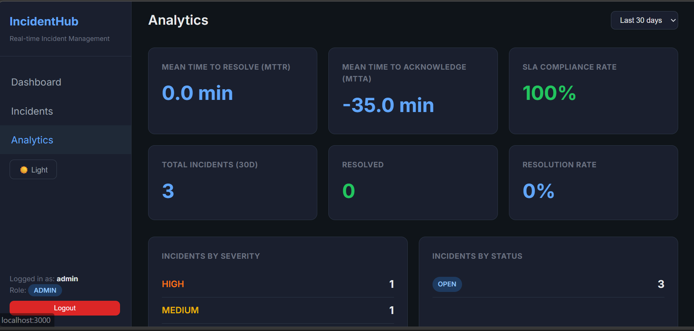

# IncidentHub - Real-Time Incident Management Platform

[](https://github.com/tushard212/IncidentManagement/actions/workflows/ci.yml)

A full-stack **enterprise-grade** incident management system built with **Spring Boot 3** and **React 18**, designed to demonstrate production-ready patterns: real-time WebSocket notifications, SLA-driven auto-escalation, RBAC, distributed caching, and comprehensive observability.

## Screenshots

### Login


### Dashboard


### Analytics


## Tech Stack

### Backend
- **Java 17** + **Spring Boot 3.2.5**
- **Spring Security 6** with stateless JWT Authentication (jjwt 0.12.5)
- **Spring Data JPA** with Hibernate 6
- **H2** (dev) / **PostgreSQL** (prod) — with read/write splitting via `AbstractRoutingDataSource`
- **Redis** for caching (TTL-based) & distributed locks
- **Spring Mail + Thymeleaf** — Templated email notifications
- **Spring Retry** with exponential backoff
- **WebSocket (STOMP/SockJS)** for real-time push
- **Micrometer + Prometheus** for custom business metrics
- **SpringDoc OpenAPI 2.3** (Swagger UI with JWT auth)
- **Lombok** + **MapStruct-style** DTOs

### Frontend
- **React 18** + **TypeScript**
- **React Router v6** (SPA routing)
- **Axios** with JWT interceptors & automatic token refresh
- **STOMP.js** + **SockJS** for WebSocket
- **Dark/Light theme** toggle with CSS variables

### DevOps
- **GitHub Actions** CI/CD (build + test on every push)
- **Maven Wrapper** (no local Maven install required)
- **Profile-based configuration** (dev / prod)

## Features

### Core Incident Management
- **Incident CRUD** — Create, update, assign, resolve with full lifecycle tracking
- **Status Workflow** — OPEN → ACKNOWLEDGED → INVESTIGATING → RESOLVED
- **Timeline History** — Every state change recorded with timestamp and actor
- **Severity Levels** — CRITICAL, HIGH, MEDIUM, LOW with SLA-driven deadlines

### Real-Time & Notifications
- **WebSocket Dashboard** — Live stats pushed via STOMP on every incident change
- **Email Notifications** — Auto-triggered on create, escalate, and resolve
- **Notification Dashboard** — Admin/Manager view of all email logs with stats

### Automation
- **SLA Auto-Escalation** — Scheduler detects breached SLAs and escalates severity
- **On-Call Routing** — Escalations auto-assign to current on-call engineer

### Security & Access Control
- **JWT Auth** — Stateless token-based authentication
- **RBAC** — ADMIN, MANAGER, ENGINEER roles with method-level security
- **Rate Limiting** — Custom sliding-window algorithm per IP/user (AOP-based)
- **Brute-Force Protection** — Login endpoint limited to 10 attempts/minute

### Analytics & Observability
- **MTTR/MTTA Metrics** — Mean time to resolve & acknowledge
- **SLA Compliance Rate** — Percentage of incidents resolved within SLA
- **Severity Breakdown** — Charts by severity, status, team
- **Audit Trail** — Async audit logging of all mutations with entity tracking
- **Prometheus Metrics** — Custom counters for incidents created/resolved/escalated

### Collaboration
- **File Attachments** — Upload/download files per incident (max 10MB)
- **Share Links** — URL shortener with click tracking for sharing via Slack/Teams
- **Team Management** — Create teams, assign members, route incidents

### Infrastructure Patterns
- **Redis Caching** — Dashboard stats & analytics cached with TTL eviction
- **Distributed Lock** — Prevents duplicate scheduler execution across nodes
- **Read/Write Splitting** — `@Transactional(readOnly=true)` routes to read replica
- **Load Balancer Health** — Graceful drain/resume for zero-downtime deployments
- **Spring Retry** — Exponential backoff on transient failures

## API Documentation

Interactive API docs available at: **http://localhost:8080/swagger-ui.html**

Authenticate via the "Authorize" button with a JWT token from `/api/auth/login`.

### Endpoints Overview

| Group | Method | Endpoint | Description |
|-------|--------|----------|-------------|
| **Auth** | POST | `/api/auth/login` | Login & get JWT token |
| | POST | `/api/auth/register` | Register new user |
| **Incidents** | GET | `/api/incidents` | List incidents (paginated) |
| | POST | `/api/incidents` | Create incident |
| | GET | `/api/incidents/{id}` | Get incident with timeline |
| | POST | `/api/incidents/{id}/status` | Update status |
| | POST | `/api/incidents/{id}/acknowledge` | Acknowledge incident |
| | DELETE | `/api/incidents/{id}` | Delete (ADMIN/MANAGER) |
| | GET | `/api/incidents/dashboard/stats` | Live dashboard stats |
| **Attachments** | POST | `/api/incidents/{id}/attachments` | Upload file |
| | GET | `/api/incidents/{id}/attachments` | List files |
| | GET | `/api/incidents/{id}/attachments/{aid}/download` | Download file |
| **Analytics** | GET | `/api/v2/analytics?days=30` | MTTR, MTTA, SLA compliance |
| **Audit** | GET | `/api/v2/audit` | Audit logs (ADMIN) |
| **Notifications** | GET | `/api/notifications` | Email logs (ADMIN/MANAGER) |
| | GET | `/api/notifications/stats` | Notification stats |
| **Teams** | POST | `/api/teams` | Create team |
| | GET | `/api/teams` | List teams |
| **On-Call** | POST | `/api/oncall` | Create schedule |
| | GET | `/api/oncall/team/{id}/current` | Current on-call |
| **Share Links** | POST | `/api/urls/shorten` | Create short link |
| | GET | `/s/{code}` | Redirect |
| | GET | `/api/urls` | List my links |
| **Admin** | POST | `/api/admin/lb/drain` | Drain instance |
| | POST | `/api/admin/lb/resume` | Resume traffic |

## Getting Started

### Prerequisites
- Java 17+
- Node.js 16+
- Maven 3.8+ (or use included `mvnw`)

### Backend
```bash
# Run with dev profile (H2 in-memory DB, no Redis required)
./mvnw spring-boot:run -Dspring-boot.run.profiles=dev
```
Backend starts at `http://localhost:8080`

### Frontend
```bash
cd frontend
npm install
npm start
```
Frontend starts at `http://localhost:3000`

### Default Credentials
| Username | Password | Role |
|----------|----------|------|
| admin | admin123 | ADMIN |
| manager1 | password | MANAGER |
| engineer1 | password | ENGINEER |

## Architecture

```
┌─────────────────┐       ┌────────────────────────────────────────┐
│    React SPA    │──REST──│          Spring Boot 3 API             │
│   (Port 3000)   │◀─WS──│           (Port 8080)                  │
└─────────────────┘       └──────────┬─────────────┬───────────────┘
                                     │             │
                           ┌─────────▼──┐   ┌─────▼──────────┐
                           │  Database   │   │     Redis      │
                           │ H2/Postgres │   │ Cache + Locks  │
                           └────────────┘   └────────────────┘
                                     │
                           ┌─────────▼──────────┐
                           │    SMTP Server      │
                           │  (Email Notifs)     │
                           └────────────────────┘
```

### Design Patterns Used
- **Repository Pattern** — Data access abstraction
- **DTO Pattern** — Request/Response separation from entities
- **Builder Pattern** — Lombok @Builder for clean object creation
- **Observer Pattern** — WebSocket event broadcasting
- **Strategy Pattern** — Routing DataSource for read/write splitting
- **Aspect-Oriented Programming** — Rate limiting, audit logging, DataSource routing
- **Scheduler Pattern** — Cron-based SLA escalation

## Testing

```bash
# Unit tests (mocked dependencies)
./mvnw test -Dtest=IncidentServiceTest

# Integration tests (full Spring context + H2)
./mvnw test -Dtest=IncidentIntegrationTest

# All tests
./mvnw test
```

## Monitoring & Observability

| Endpoint | Description |
|----------|-------------|
| `/actuator/health` | Health check (public) |
| `/actuator/prometheus` | Prometheus metrics (ADMIN) |
| `/swagger-ui.html` | Interactive API docs |
| `/h2-console` | H2 DB console (dev only) |

## Project Structure

```
src/main/java/com/incidenthub/
├── config/          # Security, Cache, DataSource, WebSocket, OpenAPI configs
├── controller/      # REST controllers (9 controllers)
├── dto/             # Request/Response DTOs
├── model/           # JPA entities + enums
├── repository/      # Spring Data JPA repositories
├── ratelimiter/     # Custom sliding-window rate limiter (AOP)
├── scheduler/       # SLA escalation cron job
├── security/        # JWT filter, UserDetailsService
├── service/         # Business logic layer
├── util/            # Utility classes
└── websocket/       # STOMP notification service

frontend/src/
├── components/      # Reusable UI components (Sidebar)
├── pages/           # Route pages (Dashboard, Analytics, IncidentDetail, etc.)
├── services/        # API client + WebSocket client
└── types/           # TypeScript interfaces
```

## License

This project is built for portfolio/demonstration purposes.
